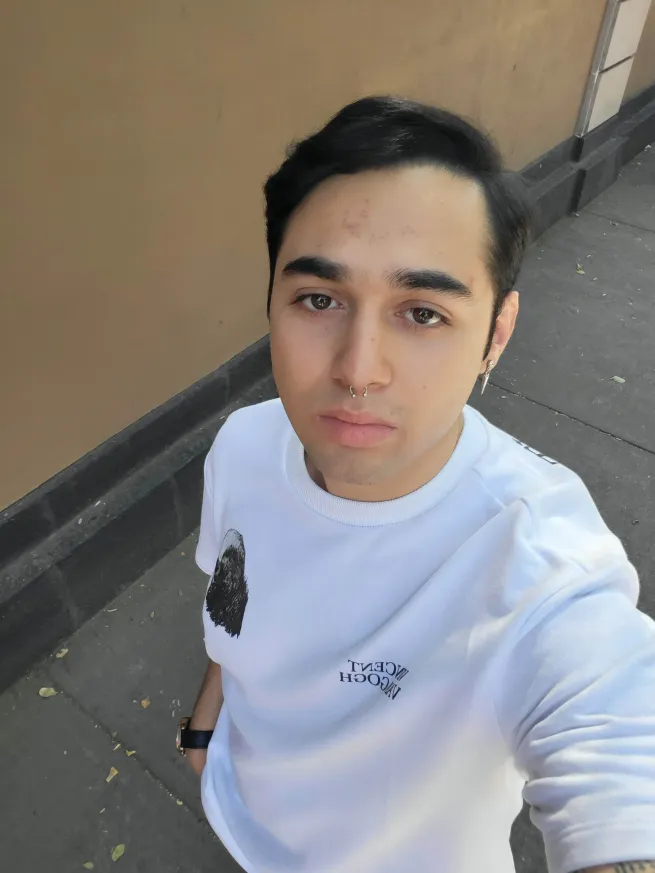

# Diego Alejandro Cáceres Cabello
Hola mucho gusto mi nombre como lo podra notar en el título es Diego, tengo 22 años, soy Geminis (_Por si tenia la duda verdad_).

 El motivo por el cual escogí esta carrera es porque desde hace tiempo me había interesado la programación y queria aprender mejor ya que siempre se me hizo muy interesante y me encanta siempre estar a la vanguardia de la tecnología, otro motivo por el cual estoy aqui es porque la verdad se que en este ambito si eres alguien autodidacta y que siempre busca soluciones puede generar bastante dinero, ya sea creando páginas web, aplicaciones, videojuegos (_Eso si pegan y se hacen muy famosos_) y eso me gusta bastante, a quien no lo gustaría tener dinero.

## Mis pasatiempos
1. Me gusta mucho ver peliculas.
1. Me gusta ver series.
1. Me encanta jugar videojuegos.
1. Me gusta salir con mis amigos.

## Mis Redes Sociales
- [Instagram](https://www.instagram.com/the_boom010?igsh=cjRwMG9pNWpjZWFk&utm_source=qr)
- [Steam](https://steamcommunity.com/profiles/76561198406266024/)
- [Se acepta el follow](https://www.twitch.tv/dbomd)

## Entregables
- [Práctica 1]()
- [Práctica 2](./mds/ramas-fusiones.md)
- [Práctica 3](./mds/etiquetas.md)
- [Práctica 4](./mds/primer-parcial.md)
- [Práctica 6](./docs/snake.md)