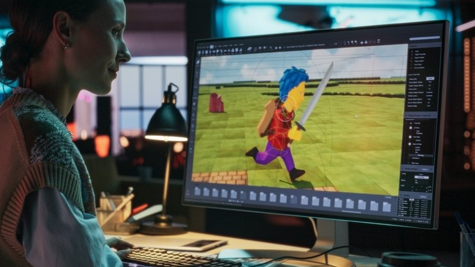
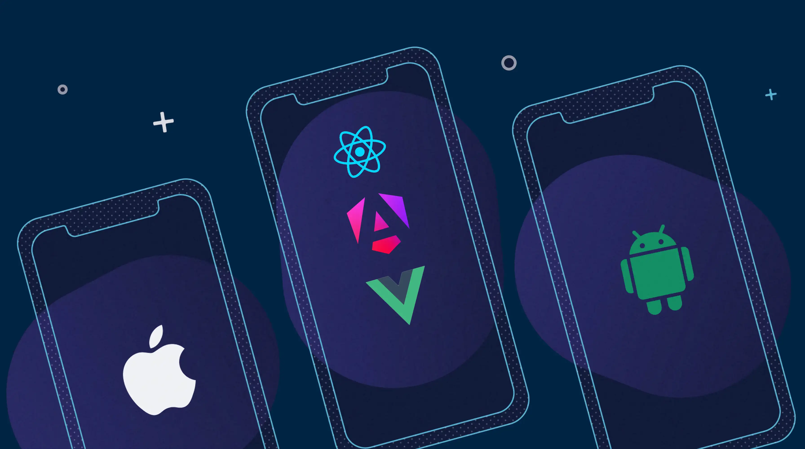
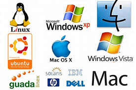

# Asignaturas 3DEVs

## Diseño de Videojuegos

### Prof. Ana Olivar

En esta materia estamos aprendiendo a como armar un GDD, vamos a ver como dieñar bien un nivel de videojuego estéticamente y aprender un poco más sobre las interfaces de _**Unity**_ y de _**Unreal Engine**_ como también familiarizarnos más con dichos softwares.

## Principios de Composición y Diseño 
### Prof. Roberto Melo Ortiz Dora

En esta materia estamos viendo todo lo relacionado con el diseño gráfico, la produccipon fotográfica y las aplicaciones de las artes visuales, en este momento nos esta enseñando todo lo relacionado con Photoshop y las técnicas que uno puede aplicar en esta misma.

Asi mismo estamos viendo la tipografía y el como en un documento o revista los elementos deben de estar organozados de cierta forma para que a la persona que este leyendo tu artículo, no se canse visualmente y se aburra y lo deje. 

## Programación en Lenguajes Interpretados 

### Prof. Jonathan MirCha

En esta materia estamos aprendiendo el como se configura el _**Git**_ desde cero, también creamos una cuenta de _**GitHub**_ y como se vincula esta con _Git_, aprendimos a como configurar nuestro _**Visual Code**_ para que este sea mucho más sencillo y nos vayamos familiarizando con este programa.

También nos enseño los comandos que tenemos que usar en _**Git**_ y como crear:
1. Carpetas
2. Archivos .txt
1. Lenguaje Markdown (como utilizarlo)
1. Listas Numeradas
1. Etc....

## Proyecto Semestral: Desarrollo de Aplicaciones Interactivas

### Prof. Eduardo Guerrero

En esta materia estamos viendo como podemos desarrollar una app para celulares la cual funcione como repaso y podramos poner a prueba lo que hemos aprendido hasta el momento,tambien irnos adaptando para futuros trabajos ya sea con personas desconocidas en tu trabajo o en algun proyecto personal. 

## Sistemas Operativos y Redes

### Prof. Alcides Albora

En esta materia estamos aprendiendo a como ingresar a ubuntu para abrir un escritorio virtual asi mismo como los comandos los cuales son bastantes parecidos a los de git lo cual facilita su aprendizaje y tambien vimos los componentes de una computadora y la importancia de la bios. 

